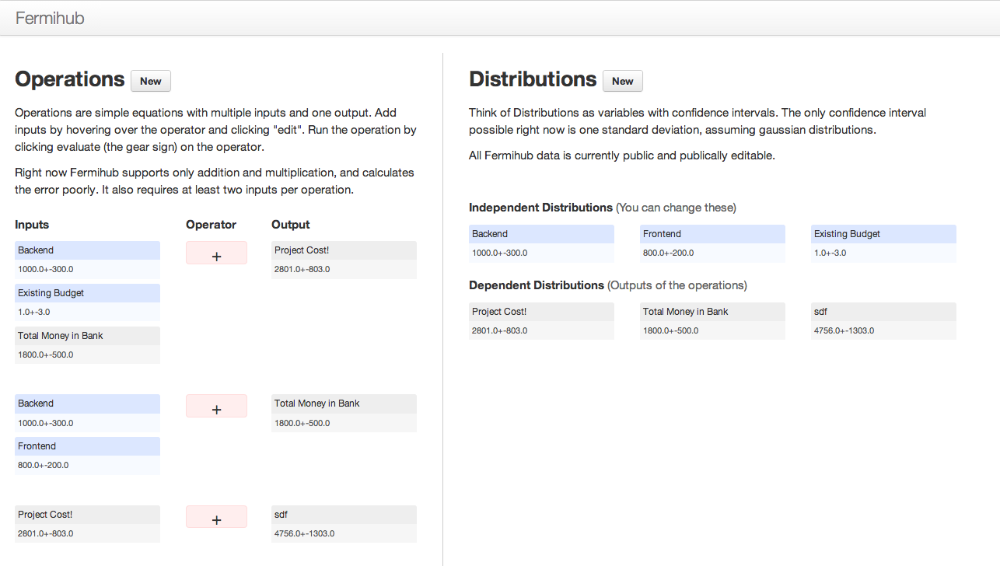

== Welcome to Fermihub!

Fermihub is an open source project and website to help people make fermi estimates.

== What is a Fermi Estimate?

Fermi Estimates are estimates made by combining multiple approximations, often with addition and multiplication.

== Confidence Intervals

Fermihub is made to work with confidence intervals.  Each estimate is given a confidence interval, creating a likelyhood distribution.  These distributions are then used for calculations, preferably in large sets of equations.  Because everything is kept neat and on a computer, the resulting confidence intervals will be figured out for you.

== Up and Running

The code is written to be easily work with heroku.  Just create a new heroku instance and do the typical commands for a Rails App.  The database is PostgreSQL.

== License

The MIT License (MIT)
All code is under the MIT License.
Copyright (c) 2013, Ozzie Gooen

